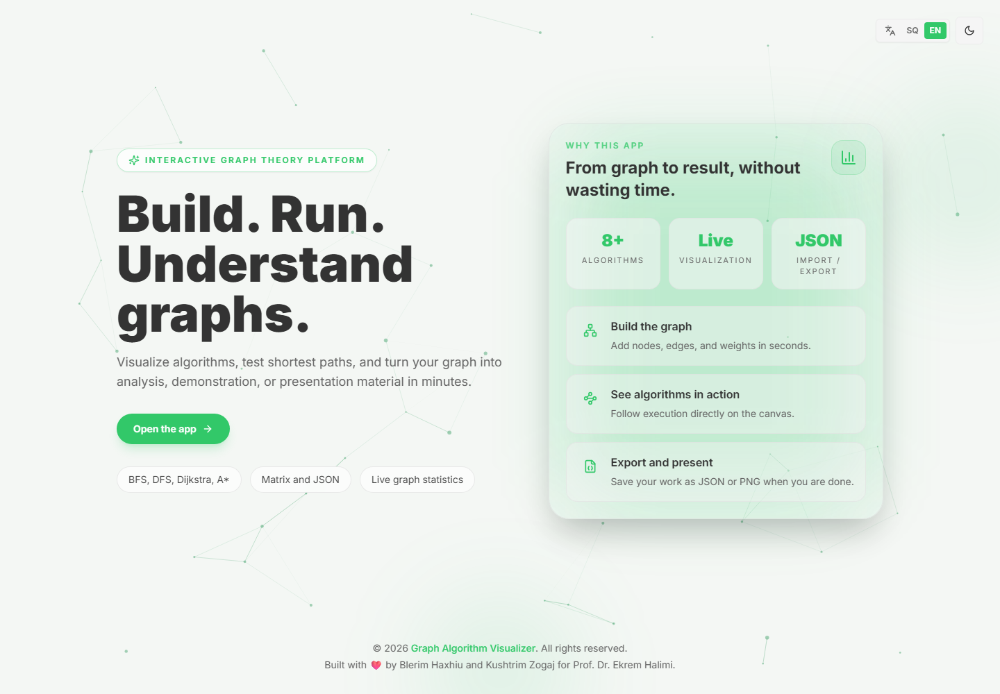
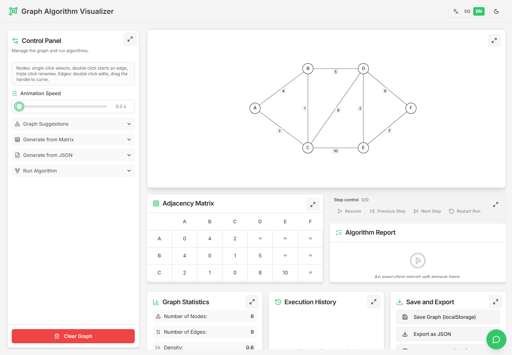
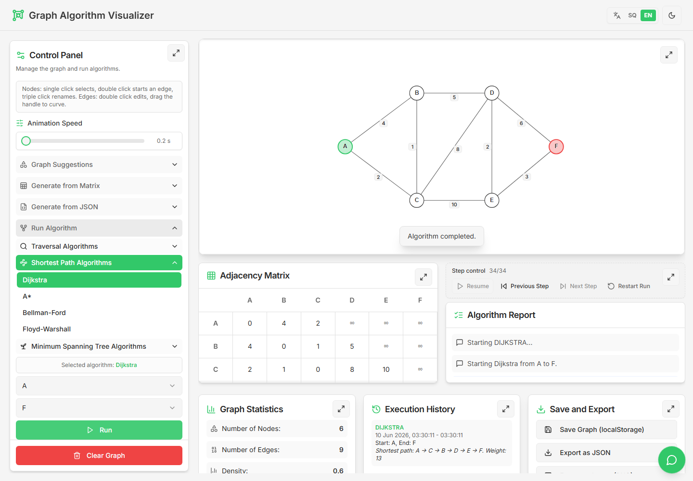
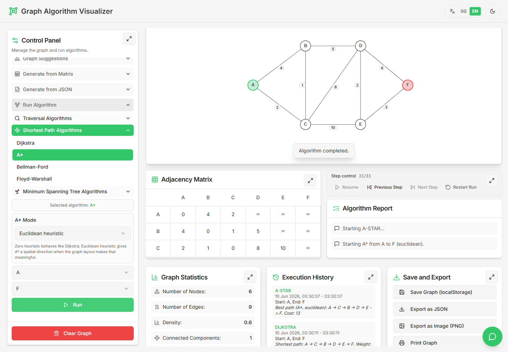
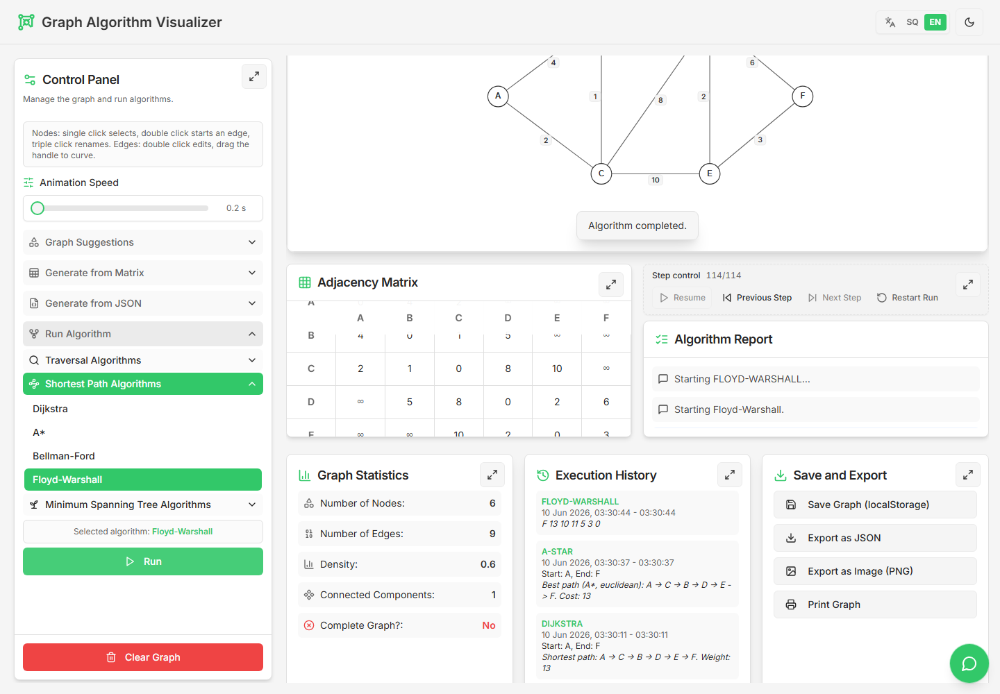
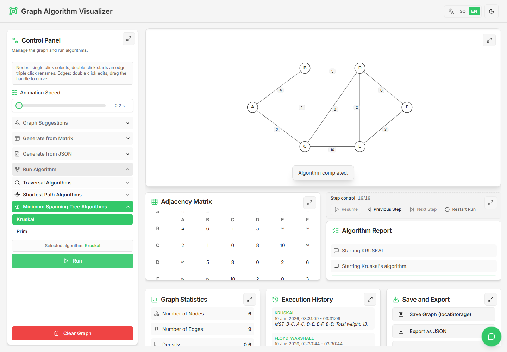
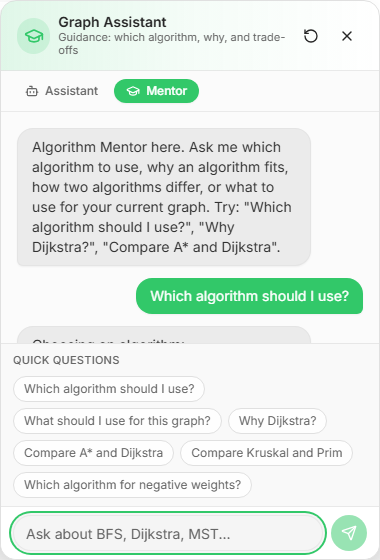
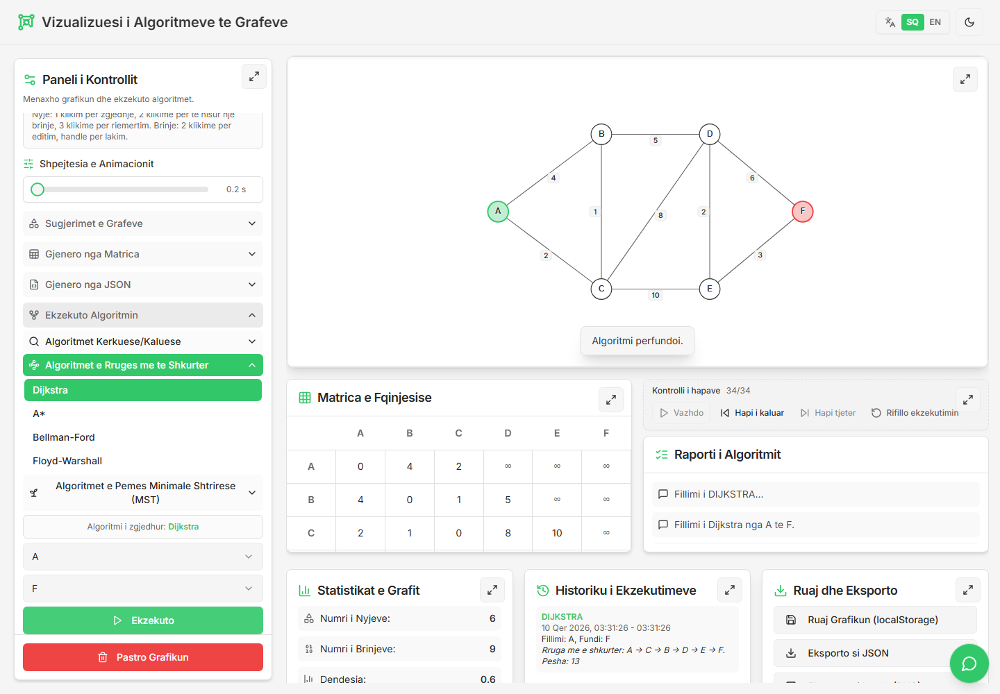
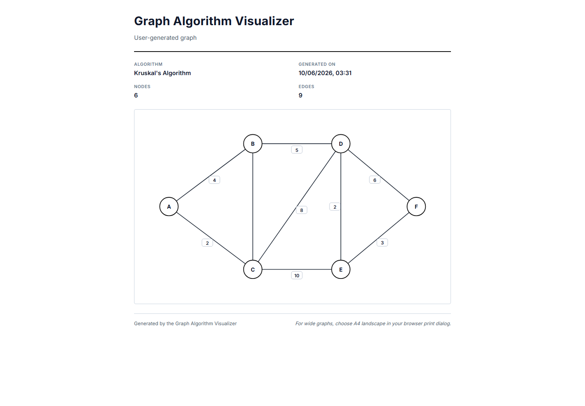

# Interactive Graph Algorithm Visualization and Learning Platform

> Build a graph, watch an algorithm run step by step, and ask a built-in tutor *why*.

An interactive, bilingual platform for learning graph theory. Users create their
own graphs on an SVG canvas, run eight classic algorithms with full step-by-step
visualization and manual playback, inspect the live adjacency / distance matrix,
compare runs, export results — and get guidance from a **deterministic, local
Algorithm Mentor** that recommends, explains, and compares algorithms and even
explains *why a specific node was selected* during a run. It ships as a fully
static Next.js export deployed on Netlify.

**Live demo → https://teoriaegrafeve.netlify.app**

---

## Demo Highlights

- **8 graph algorithms** with animated, step-by-step execution
- **Interactive SVG graph editor** — weighted/unweighted, directed/undirected, curved & parallel edges, self-loops
- **A\* learning mode** — switch between Euclidean and zero heuristics and watch `g(n) / h(n) / f(n)`
- **Manual playback controls** — pause, resume, step forward/back, restart
- **Floyd–Warshall matrix visualization** — live working distance matrix with highlighted updates
- **MST visualization** — Kruskal & Prim with final spanning-tree highlight
- **Deterministic Algorithm Mentor** — local, no API key, graph-aware Q&A
- **English / Albanian** localization across UI, explanations, and the tutor
- **JSON / PNG export** and **printable reports**
- **Tested** — algorithm, playback, chatbot, mentor, and translation suites

## Screenshots

| Landing | Workspace | Dijkstra |
| --- | --- | --- |
|  |  |  |

| A\* (Euclidean) | Floyd–Warshall matrix | Kruskal MST |
| --- | --- | --- |
|  |  |  |

| Algorithm Mentor | Albanian UI | Printable report |
| --- | --- | --- |
|  |  |  |

> All 12 screenshots live in [`docs/screenshots/`](docs/screenshots/) and are
> reproducible with `npm run demo:screenshots` (see
> [Screenshot Capture Guide](docs/SCREENSHOT_CAPTURE_GUIDE.md)).

## Problem Statement

Graph algorithms are usually taught with static diagrams, pseudocode, and
theory-heavy slides. Students can memorize Dijkstra without ever *seeing* why it
visits nodes in a particular order, or why A\* needs an admissible heuristic.

This platform turns the algorithms into an interactive experience: build a graph,
run an algorithm, step through every decision, read a plain-language report,
compare algorithms empirically, and ask a tutor for help — in English or
Albanian.

## Key Features

- Interactive SVG graph editor (weighted/unweighted, directed/undirected, curved/parallel edges, self-loops)
- Graph generators (Complete K4, Star, Cycle, Tree, custom) + import from adjacency matrix or JSON
- Step-by-step algorithm visualization (visited nodes, traversed edges, highlighted paths, matrix updates)
- Manual playback: pause, resume, next/previous step, restart
- Live adjacency matrix that switches to the Floyd–Warshall working distance matrix during execution
- Graph statistics + degree-distribution chart
- Execution history and algorithm comparison
- Deterministic, local Algorithm Mentor (no external API)
- Natural-language command assistant ("Run Dijkstra from A to F")
- English / Albanian localization with parity tests
- JSON / PNG export and printable reports
- Local persistence via `localStorage`
- Light / dark theme

## Supported Algorithms

| Algorithm | Purpose | Complexity |
| --- | --- | --- |
| BFS | Level-by-level traversal; shortest path by edge count | `O(V + E)` |
| DFS | Deep structural exploration | `O(V + E)` |
| Dijkstra | Shortest paths with non-negative weights | `O(E log V)` |
| A\* | Goal-directed shortest path with a configurable heuristic — **Euclidean** (default, admissibly scaled) or **zero** (Dijkstra-equivalent) | `O(E log V)` |
| Bellman–Ford | Single-source shortest paths with negative edges + negative-cycle detection | `O(V · E)` |
| Floyd–Warshall | All-pairs shortest paths (dynamic programming) | `O(V³)` |
| Kruskal | MST via sorted edges + Union–Find | `O(E log E)` |
| Prim | MST grown from a start node | `O(E log V)` |

## Algorithm Mentor

The Mentor (`src/lib/mentor/`) is a **deterministic, fully local** tutor — no
API key, no LLM, no network. A single entry point `generateMentorResponse()`
classifies a question into one of five intents and answers from hand-written,
tested knowledge:

- **Recommends algorithms** — *"Which algorithm should I use?"*
- **Graph-aware recommendations** — analyzes the *loaded* graph (weights, direction, density) and suggests a fit
- **Compares algorithms** — *"Compare A\* and Dijkstra"*
- **Explains algorithms** — *"Why Dijkstra?"*, complexity, constraints, trade-offs
- **Explains steps** — *"Why was this node selected?"* grounded in the **current run step** (and it honestly says when there is no active step rather than inventing one)

It is bilingual (English + Albanian) and covered by 13 unit checks. Because it is
deterministic, its behavior is testable and reproducible — the same discipline
production automation needs. See
[`docs/ALGORITHM_MENTOR_ARCHITECTURE.md`](docs/ALGORITHM_MENTOR_ARCHITECTURE.md).

## A\* Learning Mode

A\* is built as a teaching tool. You can switch the heuristic from the UI:

- **Euclidean heuristic** — `h(n)` is the straight-line distance to the goal,
  scaled by an **admissible** factor (`getMinWeightPerPixel`) so it never
  overestimates true graph cost. This keeps A\* optimal while still guiding the
  search toward the goal.
- **Zero heuristic** — `h(n) = 0`, which makes A\* behave exactly like Dijkstra
  — a perfect side-by-side comparison of "informed vs. uninformed" search.

Every expansion reports the three numbers that make A\* click:

- **`g(n)`** — cost from the start to `n`
- **`h(n)`** — heuristic estimate from `n` to the goal
- **`f(n) = g(n) + h(n)`** — the priority A\* uses to choose the next node

See [`docs/ASTAR_EDUCATIONAL_GUIDE.md`](docs/ASTAR_EDUCATIONAL_GUIDE.md).

## Playback Controls

Each algorithm emits an ordered list of typed steps, and the entire UI is a pure
function of the current step index — which makes a real step-debugger almost
free:

- **Pause / Resume** the animation
- **Next step / Previous step** to move one decision at a time
- **Restart** to replay from the beginning
- A `current / total` counter and a synchronized, step-aware report log

See [`docs/PLAYBACK_CONTROLS_IMPLEMENTATION.md`](docs/PLAYBACK_CONTROLS_IMPLEMENTATION.md).

## Testing

Lightweight, fast regression tests (plain Node + `sucrase`, no heavy framework):

```bash
npm run test:algorithms     # 8 algorithms: shortest paths, traversal, negative edges, Floyd-Warshall, MST, A* heuristics
npm run test:chatbot        # bilingual NL command parser (EN/SQ, typo tolerance)
npm run test:mentor         # deterministic Mentor: intents, step-why grounding, bilingual knowledge parity
npm run test:translations   # EN/SQ translation parity + example-step consistency
npm run test:playback       # playback helpers: step indexing, report reconstruction, progress labels
npm run typecheck           # tsc --noEmit
```

All suites pass. See [`docs/TESTING_STRATEGY.md`](docs/TESTING_STRATEGY.md).

## Installation

**Prerequisites:** Node.js 18+ and npm.

```bash
npm install
npm run dev            # http://localhost:9002
```

Production build (static export to `out/`):

```bash
npm run build
```

Generate the demo screenshots (optional):

```bash
npm run demo:screenshots
```

## Tech Stack

- **Next.js 15** (`output: 'export'`, static site)
- **React 18** + **TypeScript**
- **Tailwind CSS** + **Radix UI**
- **Framer Motion**, **Lucide** icons, **Recharts**
- Custom **SVG** graph rendering
- **Playwright** (demo screenshot automation)
- **Netlify** static hosting

## Project Structure

```
grafishqipp/
├── src/
│   ├── app/                 # Next.js routes (landing `/`, workspace `/app`)
│   ├── components/
│   │   ├── graph/           # canvas, panels, playback, matrix, export, comparison
│   │   ├── chatbot/         # Algorithm Mentor / assistant widget
│   │   └── ui/              # Radix-based design system
│   ├── lib/
│   │   ├── graph-algorithms.ts   # the 8 algorithms (step emitters)
│   │   ├── graph-utils.ts        # normalization, adjacency, statistics
│   │   ├── playback-utils.ts     # pure playback helpers
│   │   ├── mentor/               # deterministic tutor (intents + engines)
│   │   ├── chatbot-*.ts          # NL command parser + action handler
│   │   └── translations.ts       # EN/SQ strings
│   └── types/graph.ts       # Node, Edge, AlgorithmStep, AStarHeuristicMode
├── tests/                   # algorithm/playback/chatbot/mentor/translation tests
├── tools/screenshots/       # Playwright capture system
├── docs/                    # architecture, education & portfolio docs
└── netlify.toml             # build = `npm run build`, publish = `out`
```

## Portfolio Value

- **Algorithm engineering:** eight algorithms implemented from scratch as
  step-emitting functions, including an **admissibly scaled A\*** heuristic that
  preserves optimality.
- **Architecture:** a clean step-stream model — the UI, playback, reports, and
  matrix are pure renderers of a typed `AlgorithmStep[]`.
- **Deterministic "agent":** the Mentor parses intent and answers from tested
  knowledge, grounded in live run state — automation discipline without an LLM.
- **Product polish:** bilingual UX, exports, printable reports, dark mode,
  comparison tooling.
- **Engineering hygiene:** typed, tested, static-deployed, documented.

More: [`docs/PORTFOLIO_VALUE.md`](docs/PORTFOLIO_VALUE.md),
[`docs/PORTFOLIO_DEMO_GUIDE.md`](docs/PORTFOLIO_DEMO_GUIDE.md),
[`docs/DOCUMENTATION_INDEX.md`](docs/DOCUMENTATION_INDEX.md).

## Author

**Blerim Haxhiu** — design, algorithm engineering, and implementation.

## License

Released under the [MIT License](LICENSE).
