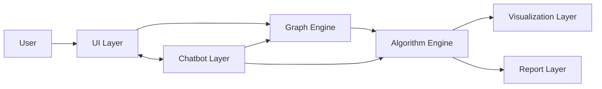
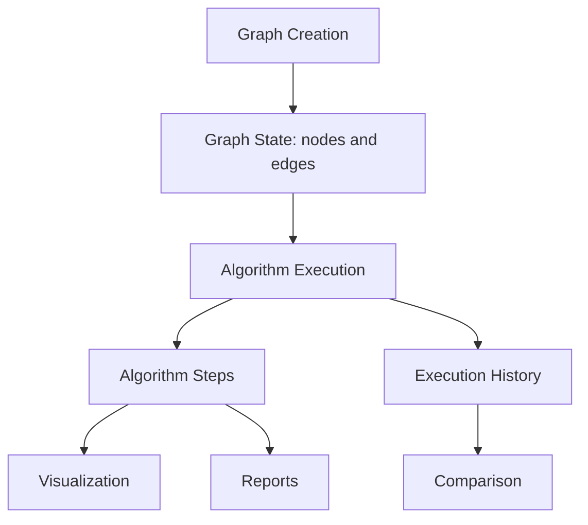
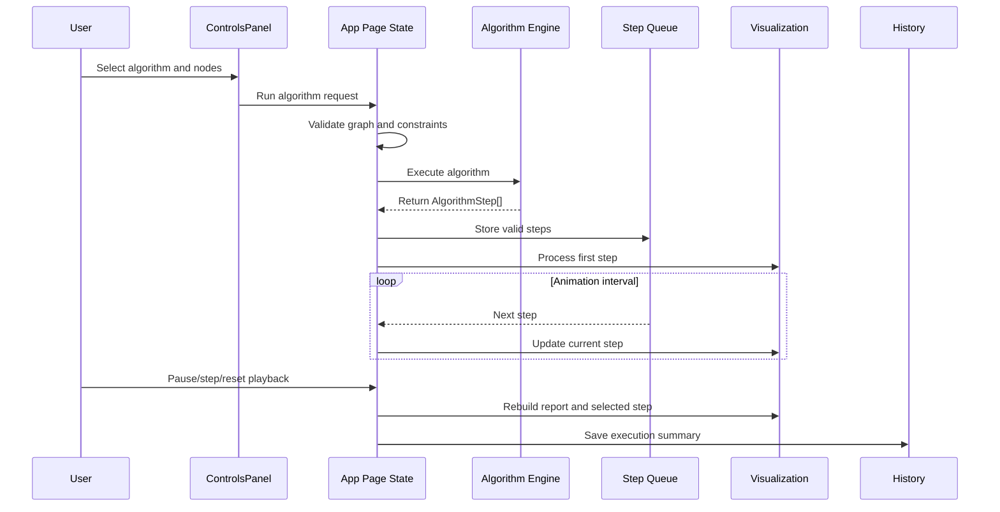

# Architecture Overview

This document explains the current architecture of the Interactive Graph Algorithm Visualization and Learning Platform. It is intended for recruiters, engineering managers, mentors, professors, contributors, and future maintainers.

## High-Level Architecture

The app is a client-side Next.js/React application centered around an interactive graph workspace. Users manipulate graph data through the UI, algorithm functions produce ordered execution steps, and those steps drive visualization, reports, history, comparison, and chatbot context.

## Application Structure

### App Layer

- `src/app/page.tsx` renders the landing page.
- `src/app/app/page.tsx` owns the main app state, including nodes, edges, selected start/end nodes, algorithm steps, playback state, report log, execution history, fullscreen sections, save/export/import handlers, and chatbot automation bindings.
- `src/app/layout.tsx` provides the global app shell, providers, metadata, and styles.
- `src/app/app/layout.tsx` wraps the main workspace route.

### Components Layer

Graph-specific components live under `src/components/graph`.

Key responsibilities:

- `GraphCanvas.tsx`: interactive SVG graph editing and algorithm highlighting.
- `ControlsPanel.tsx`: graph generation, matrix/JSON import, algorithm selection, start/end selection, and animation speed.
- `AdjacencyMatrixTable.tsx`: matrix display and cell highlighting.
- `AlgorithmReportPanel.tsx`: step-by-step report log.
- `PlaybackControls.tsx`: pause, resume, next, previous, and restart controls for algorithm step playback.
- `GraphStatsPanel.tsx`: graph metrics.
- `ExecutionHistoryPanel.tsx`: recent run history.
- `CompareAlgorithmsPanel.tsx`: algorithm comparison table.
- `ExportPanel.tsx`: save, JSON export, PNG export, and print actions.
- `AlgorithmExplanationPanel.tsx`: compact and detailed educational explanations.
- `PrintableGraphReport.tsx`: print-only report output.

### Graph Engine

The graph engine is not a separate runtime service. It is the combined graph state and helper logic in:

- `src/types/graph.ts`
- `src/lib/graph-utils.ts`
- graph state inside `src/app/app/page.tsx`

It manages:

- node and edge shapes,
- edge normalization,
- directed/undirected behavior,
- adjacency matrix generation,
- graph statistics,
- node/edge ID generation,
- graph serialization,
- graph validation during JSON import.

### Algorithm Engine

Algorithm implementations live in `src/lib/graph-algorithms.ts`.

The engine accepts graph data and returns `AlgorithmStep[]`. It does not directly render UI. This makes algorithm output reusable across the canvas, report panel, matrix panel, history, and print flow.

### Chatbot

The chatbot layer includes:

- `src/components/chatbot/GraphChatbot.tsx`
- `src/lib/chatbot-command-parser.ts`
- `src/lib/chatbot-action-handler.ts`
- `src/lib/chatbot-responses.ts`

It provides educational responses and deterministic command automation for supported algorithm actions.

### Localization

Localization is handled through:

- `src/components/language-provider.tsx`
- `src/hooks/use-language.ts`
- `src/lib/translations.ts`
- `src/lib/algorithm-explanations.ts`
- `src/lib/algorithm-example-steps.ts`
- `src/lib/algorithm-example-steps-en.ts`

The app currently supports English and Albanian.

### Export System

Export and presentation features include:

- local save/load via `localStorage`,
- JSON export through browser blob download,
- PNG export by serializing the SVG and drawing it to canvas,
- printable reports through `PrintableGraphReport.tsx`.

## Data Flow

Graph data is created manually, generated from presets, imported from a matrix, imported from JSON, or restored from local storage. The graph state is then passed into algorithm functions. Algorithm functions return ordered steps, which are consumed by the playback state, animation loop, and UI panels.

## Execution Flow

Validation currently checks for:

- required start node,
- required end node,
- MST algorithms on directed graphs,
- negative weights for Dijkstra and A*.

## Architectural Strengths

- Clear separation between algorithm functions and visual rendering.
- Algorithm execution steps provide a useful contract between computation and UI.
- Playback state reuses the same `AlgorithmStep[]` contract for auto-play and manual stepping.
- Graph utilities centralize normalization, adjacency matrix generation, serialization, and statistics.
- Chatbot command handling is deterministic and bounded.
- Localization is broad and covered by translation parity tests.
- Multiple output surfaces reuse the same graph state: canvas, matrix, report, history, comparison, export, and print.
- The app demonstrates a real interactive state machine rather than static algorithm examples.

## Current Limitations

- The main app page, controls panel, and graph canvas currently use `@ts-nocheck`.
- Production build settings currently ignore TypeScript and ESLint failures.
- `src/app/app/page.tsx` is large and owns many responsibilities.
- `GraphCanvas.tsx` is also large and combines rendering, interaction handling, dialogs, and geometry logic.
- Algorithm comparison timing measures step generation, not full user-perceived animated runtime.
- Floyd-Warshall step data includes matrix updates, but the displayed matrix remains the base graph adjacency matrix rather than a fully animated working distance matrix.
- There are no browser-based end-to-end tests for the main interaction workflows.
- Playback controls have unit-tested helpers, but still need browser-based workflow tests.
